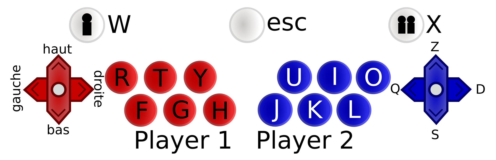

# Borne d'arcade - fiche technique

**EN** This is the launcher utility for P++'s arcade.\
**FR** Ceci est l'utilitaire de lancement pour les jeux de la borne d'arcade.

## Dev. des jeux

Les jeux sont développés principalement par P++, si vous avez un jeu à publier ou une suggestion à apporter faites ça sur le discord.
Si vous voulez développer un jeu, lisez la suite... Si vous faites du java vous pouvez développer à partir de [Akahara/retro-games](https://github.com/Akahara/retro-games) (shameless ad).

### Connexion internet

La connexion internet de la borne est très mauvaise, elle ne pourra sans doute pas supporter les jeux multijoueurs qui ne tournent pas en local, et si vous faites un jeu web pensez à bundler toutes les ressources avec le jeu.

### Gestion de la fenêtre

Le jeu doit s'ouvrir en "borderless fullscreen", le plein-ecran simple peut poser quelques problêmes. Pas besoin de demander le focus de l'application, quand un jeu démarre le launcher effectue un click gauche au centre de l'écran pour être sûr que le focus est bien sur le jeu.

> Quelques jeux peuvent avoir besoin de s'ouvrir *après* que le launcher se soit caché, dans ce cas il faut ajouter `hide_launcher` à la liste `mods` du game.json.

### Contrôles

Layout des touches utilisées :



Par convention le bouton blanc du milieu sert à lancer **et quitter** les jeux.
Pour publier un jeu faites une notices des contrôles, il y a la police à utiliser et les images nécessaires dans `doc/`.
Les images sont en svg, il faut les exporter en png.

### Versions installées

| software | version | details |
| --- | -- | --- |
| Python | 3.10 | - |
| Java | JDK 19 | OpenJDK (en plus du JRE), Eclipse est installé |
| nodejs | à vérifier | pas de package npm |
| web | firefox/chrome | pour les jeux webs |
| c++ | c++20 | Cmake et VS sont installés, il faudra sans doute re-compiler sur la borne directement |
| opengl | 3.3 | - |

### Structure des fichiers

Pour déployer un jeu il faut suivre la structure suivante :

```
<nom-du-jeu>/
├── game/
│   ├── executable.exe  (n'importe quel nom/extension)
|   ├── scores.txt      (optionnel)
│   └── ... fichiers de sauvegarde, de ressources...  
└── meta/
    ├── game.json  
    ├── vignette.png  (optionnel)
    ├── cartridge.png (optionnel)
    ├── controls.png  (optionnel)
    └── ... fichiers de sources, de notes, de contact si besoin...
```

Les deux images pour présenter le jeu sont la vignette et l'image de jaquette. La vignette est en  
ratio 10:17 et la jaquette est en 1:1 Vous pouvez faire des images de 100x170px et 500x500px par exemple.
Pour la vignette une image en 1:2 fait l'afaire, elle sera un tout petit peu étirée.

L'image des contrôles n'a pas de format imposé, elle sera plus lisible si elle est carré.

#### game.json

Format à suivre :
```json
{
    "title":           string,
    "creation_date":   string,
    "description":     multiline string,
    "authors":         string[],
    "run_command":     string[],
    "tags":            tag[],
    "mods":            mod[],
}
```

La descritption doit contenir les `\n`, une ligne fait environ 20 charactères max. Les mods sont des actions que doit effectuer le launcher qui sont spécifiques au jeu, par défaut il n'y en a pas besoin.

Tags possibles : `versus`, `coop`, `solo`, `platformer`, `shoot them up`, `beat them up`, `rpg`, `gestion`, `strategy`, `puzzle`, `fighting game`.\
Mods possibles : `hide_launcher`.

Exemple :
```json
{
    "title": "Ping",
    "creation_date": "2023",
    "description": "Pong.\n\nCopie du jeu retro\nVictoire en 10 points",
    "authors": [ "Albin" ],
    "run_command": [ "java", "-jar", "retro-games.jar", "pong" ],
    "tags": [ "versus" ],
    "mods": [],
}
```

Pour `run_command`, il faut spécifier les arguments un-à-un, par exemple :
- (java) `[ "java", "-jar", "game.jar" ]`
- (python) `[ "python", "game.py" ]`
- (.exe) `[ "game.exe" ]`

Le jeu est exécuté dans son dossier `game/`, n'allez pas modifier des fichiers en dehors.

### Scores

Un jeu peut gérer des highscores en créant un fichier `scores.txt` dans le dossier `game/` (donc dans le dossier d'exécution). 
Syntaxe du fichier :
```
<nom1>;<score1>[;<date1>]
<nom2>;<score2>[;<date2>]
<nom3>;<score3>[;<date3>]
...
```
Par exemple :
```
jean;10
dujardin:53462
```
```
jean;10;2001-01-01
jean;6425340;2010-01-01
```
Pas de score à virgule. Pas besoin de trier les lignes (elles sont triées automatiquement par score puis par date).

### License

Pour les projets qui ne sont pas *de P++*, on vous demande d'au moins mettre votre code sur github en publique, et d'y associer une license qui nous permet de l'utiliser/le modifier. N'importe laquelle fera l'affaire mais la [license MIT](https://opensource.org/license/mit/) est une bonne base. Il vous suffit de la mettre dans un `license.txt` à la racine du repository github.

Et si vous pouvez ajouter un `readme` à votre projet, avec au moins les instructions pour le build/le compiler et possiblement un screenshot c'est sympa ! 

> On vous demande les droits de modification pour pouvoir réparer les jeux si on en a besoin un jour et possiblement laisser des gens de P++ continuer à développer les jeux. Si ça vous embête faites-le savoir, on s'arrangera.

## Maintient de la borne

Installation globale de la borne :
- Un keymapper pour relier les joysticks/boutons aux touches du clavier
- Les différents softwares (voir la section au dessus)
- Le lancement automatique du launcher.jar au démarrage
- Un auto-login de l'utilisateur windows, il n'a pas les droits admin

Pour installer un nouveau jeu il faut simplement ajouter son dossier dans le dossier `games/` à coté du launcher.
Si le launcher ne démarre plus il faudra le lancer avec `java -jar launcher.jar` pour avoir un message d'erreur clair, il y a 99% de chance que ce soit un problème dans le *game.json*.

**TODO**:

Windows 10 est installé sur le mauvaix disque, il est en virtualisation pour l'instant.
Il faudrait le réinstaller sur le bon mais ca demande de passer par le BIOS et de *tout* réinstaller.

Il faudrait activer windows, ça éviterait d'avoir le message d'activation en bas à droite et ça permettrait de mettre un fond d'écran un peu plus classe tant que le launcher n'a pas chargé.
De la même manière, il faudrait déplacer les fichiers du launcher et des jeux ailleurs que sur le bureau.

## Crédits Jeux

- [SpaceCadetPinball](https://en.wikipedia.org/wiki/Full_Tilt!_Pinball) - Jeu windows
- [Snake&Pong](https://github.com/Akahara/retro-games) - Albin
- [Tricky Tower](https://github.com/PppTours/TrickyTower) - Nicolas & Albin, jeu original [ici](https://www.trickytowers.com/)
- [Lone Stick Shooter](https://github.com/Itreza2/Lone-Stick-Shooter) - Louis
- [Polyreigns](https://github.com/PppTours/Polyreigns) - Correntin & Julien, jeu original [ici](https://store.steampowered.com/app/474750/Reigns/)

